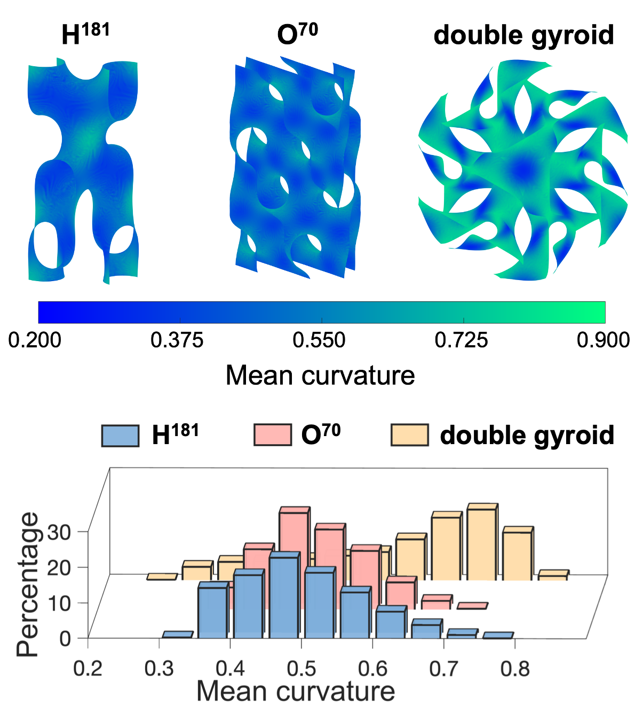

## Interface Analyzer

The Interface Analyzer package is a MATLAB-based tool designed to analyze and visualize 3D interfaces from rgrid data of [Polymer Self-Consistent Field Theory  (PSCF)]((https://github.com/dmorse/pscfpp)). This package provides functions to process the data, generate isosurfaces, and save the results for further analysis or visualization.

<p align="center">
<br>
<font size="-1"><b>Fig. 1:</b> Visualization of interfacial curvature calculated from the Interface Analyzer,.</font>
</p>

### Usage

Use the `analyzeInterface` function to process your rgrid data:

```matlab

[meanCurvature, stdCurvature, interfaceArea] = analyzeInterface('SG.rgrid', 'imds_face', 'imds_coord', 'imds_curv', 'imds_gauss')

```
### Relevant Work

The development of the Interface Analyzer package was guided by valuable insights and methodologies derived from various works:\
Chen, P., Mahanthappa, M. K., Dorfman, K. D.  [_Stability of cubic single network phases in diblock copolymer melts._](https://doi.org/10.1002/pol.20220318) J. Polym. Sci. 2022, 60(17), 2543. \
Feng, X., Burke, C.J., Zhuo, M. et al. [_Seeing mesoatomic distortions in soft-matter crystals of a double-gyroid block copolymer._](https://doi.org/10.1038/s41586-019-1706-1) Nature 575, 175–179 (2019). \
Dirk-Jan Kroon (2023). Patch Curvature (https://www.mathworks.com/matlabcentral/fileexchange/32573-patch-curvature), MATLAB Central File Exchange. Retrieved May 25, 2023.

### To-Do

- [ ] Incorporate support for periodic boundary conditions when processing rgrid data.
- [ ] Edge length regularization for the triangulated mesh.